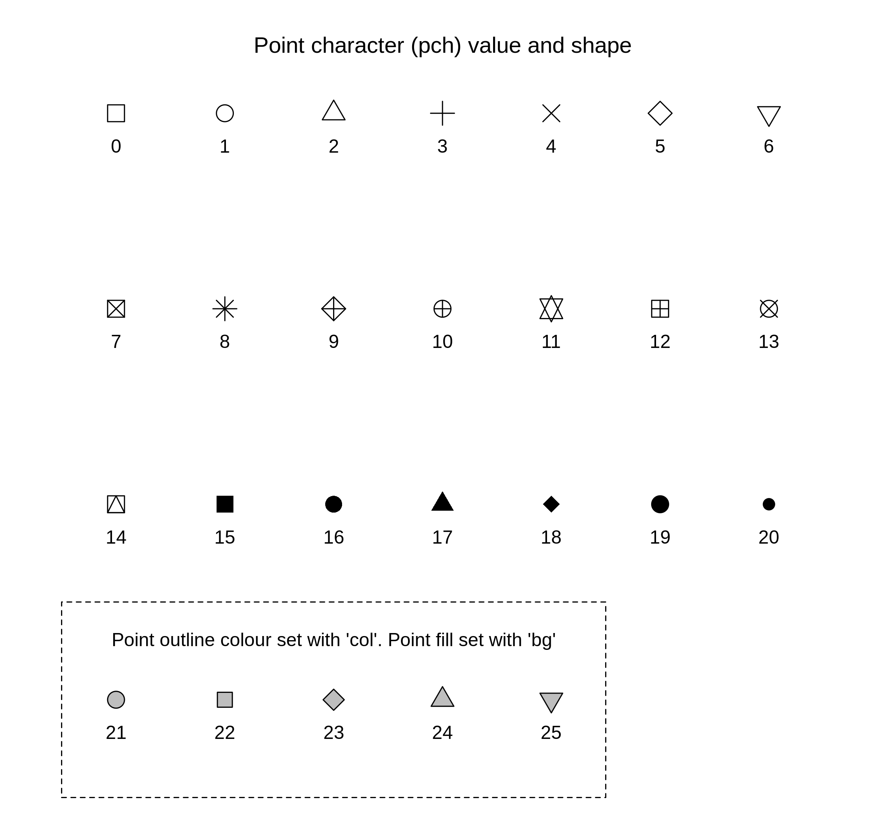
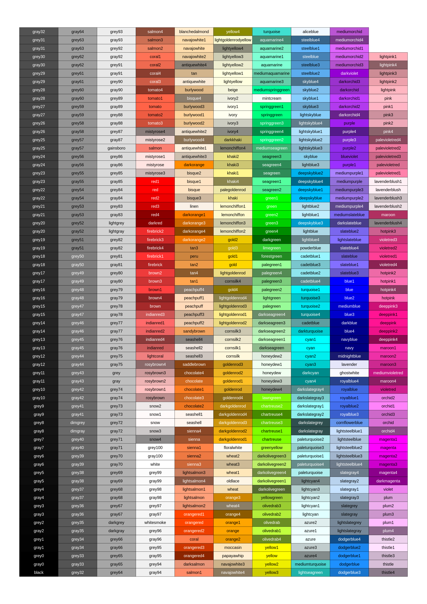

# misc R work
Some odd bits and bobs that I wanted to get version controlled and accessible from anywhere. Nothing good, but it will also help me use Git a little more.

### PCH map
A helpful chart for referencing pch values and shapes 

### R colours
A reference image of the base R colours 